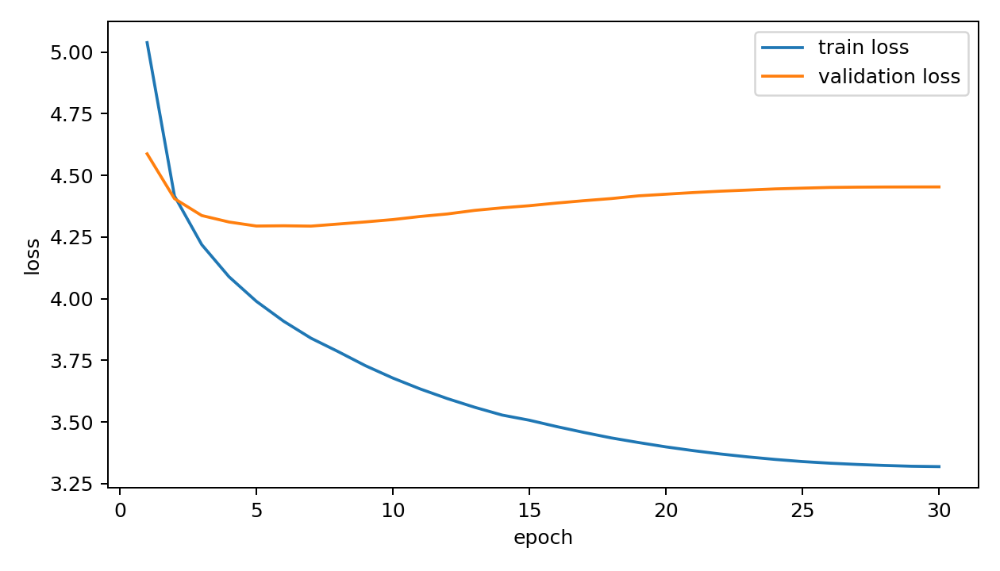
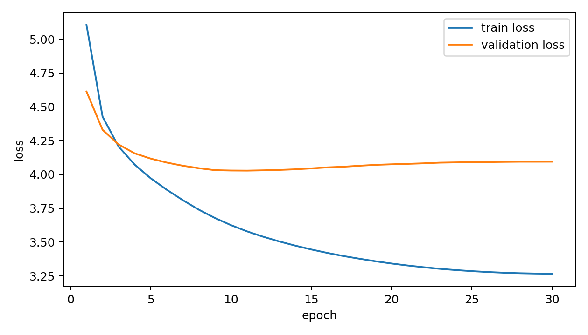
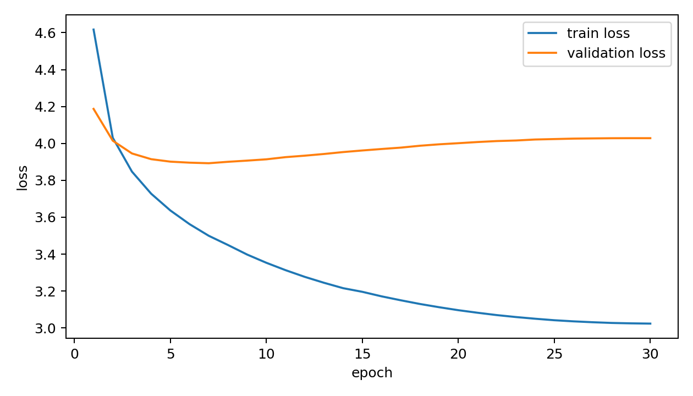
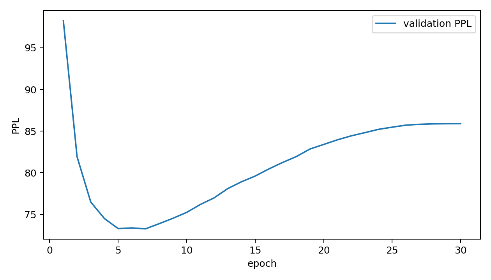
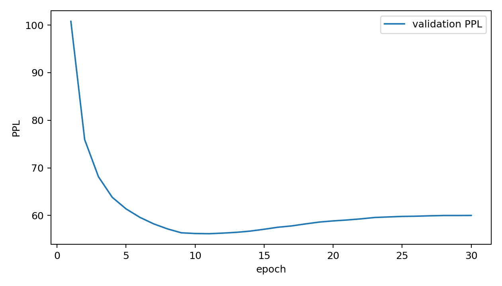
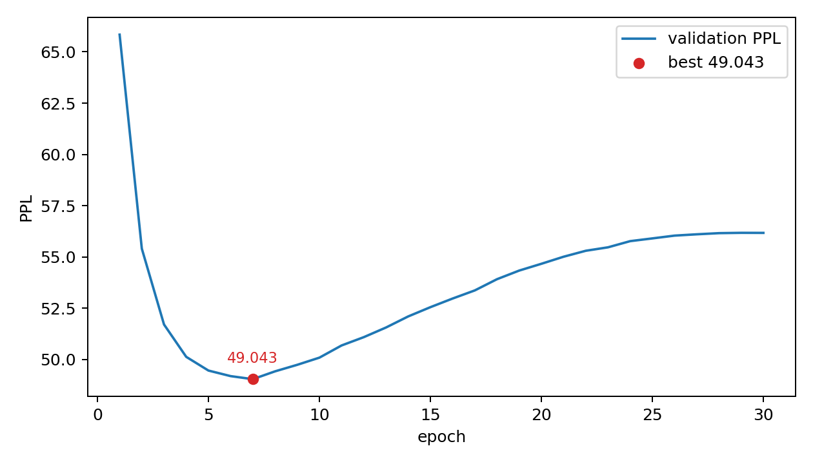
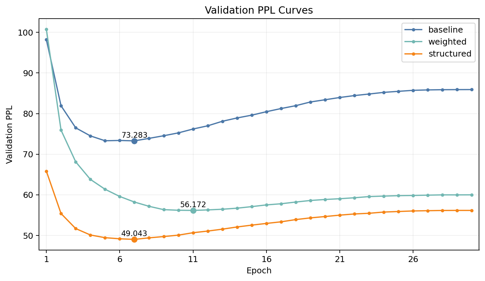

# 七言绝句条件生成系统 — 实验报告

---

## 1. 任务说明

实现一个基于字符级 GRU 的七言绝句条件生成系统。输入为首句或藏头字，输出为符合格律的四句七言绝句（每句 7 个汉字，共 4 句）。

支持两种条件生成方式：

| 模式 | 输入 | 输出 |
|------|------|------|
| 首句续写 (continue) | 7 字首句 | 保留首句，生成后 3 句 |
| 藏头诗 (acrostic) | 4 个藏头字 | 生成 4 句，每句首字对应输入 |

---

## 2. 数据处理

### 2.1 数据来源

数据集来自 [ancient-poems-dataset](https://dicalab-scu.github.io/nlp/post/ancient-poems-dataset/)，原始文件包含多种格式的古诗。本项目仅提取**严格七言绝句**（四句、每句七字）。

### 2.2 预处理流程

1. **原始文本解析**：逐行扫描，通过标点（，。）和换行符切分诗句
2. **格式校验**：仅保留 4 句 × 7 字的记录
3. **去重**：按拼接后的 28 字文本去重
4. **标点提取**：从原诗中提取标点信息（逗号、句号），生成序列时保留
5. **Fallback**：对于无标点标记的诗句，若连续 4 行均为 7 字，也作为七绝收录

### 2.3 数据统计

| 项目 | 数值 |
|------|------|
| 原始数据中七绝数量 | 138,500 |
| 去重后七绝数量 | **136,631** |
| 训练集 (90%) | 122,967 |
| 验证集 (5%) | 6,831 |
| 测试集 (5%) | 6,833 |
| 不重复汉字数 | 4,993 |
| 标点分布 | "，" 273,262 / "。" 273,262 |

### 2.4 词表构建

词表由以下部分构成（按序）：

```
<PAD>, <UNK>, <BOS>, <EOS>, <SEP>,
<TASK_FREE>, <TASK_CONT>, <TASK_ACRO>,   ← 任务控制 token
<L1>, <L2>, <L3>, <L4>,                  ← 句位标记（structured 模型使用）
， 。 ！ ？ ； ： 、                        ← 标点 token
汉字（按频次降序排列）                       ← 4,993 个字符
```

其中 `<TASK_FREE>`、`<TASK_CONT>`、`<TASK_ACRO>` 用于统一多任务训练，`<L1>`~`<L4>` 为可选的句位标记。plain 模型不使用句位标记。

### 2.5 序列构建示例

**首句续写** 的输入序列格式：
```
<BOS> <TASK_CONT> <SEP> 春 风 又 过 江 南 岸 <SEP> <L2> 细 雨 轻 沾 客 子 衣 ，
<L3> 芳 草 连 天 人 未 返 ， <L4> 一 篙 江 水 送 斜 晖 。 <EOS>
```
> 模型仅对 `<SEP>` 之后的部分计算 loss（prefix 部分 mask 为 -100）。

**藏头诗** 的输入序列格式：
```
<BOS> <TASK_ACRO> <SEP> 春 江 花 月 <SEP> <L1> 春 风 又 过 江 南 岸 ，
<L2> 江 枫 渔 火 照 愁 眠 ， <L3> 花 ... <L4> 月 ... <EOS>
```

---

## 3. 模型结构

### 3.1 基础架构

采用**字符级自回归语言模型**，架构如下：

```
Input Token IDs  (batch_size, seq_len)
      │
      ├── Token Embedding  (vocab_size → 256)
      └── Position Embedding  (max_len=64 → 32)
      │
      └── Concat → (256 + 32 = 288)
      │
      └── 2-layer GRU  (hidden_size=512, dropout=0.2)
      │
      └── LayerNorm
      │
      └── Linear Head  (512 → vocab_size)
      │
      └── Logits (预测下一个字符)
```

### 3.2 超参数配置

| 参数 | 值 |
|------|-----|
| 字符嵌入维度 (emb_dim) | 256 |
| 位置嵌入维度 (pos_dim) | 32 |
| 隐藏层维度 (hidden_size) | 512 |
| GRU 层数 (num_layers) | 2 |
| Dropout | 0.2 |
| 最大序列长度 (max_len) | 64 |
| 批大小 (batch_size) | 256 |
| 训练轮数 (epochs) | 30 |
| 学习率 (lr) | 3×10⁻⁴ |
| 权重衰减 (weight_decay) | 0.01 |
| 梯度裁剪 (grad_clip) | 1.0 |
| 优化器 | AdamW |
| 学习率调度 | CosineAnnealingLR |

### 3.3 三组模型变体

为对比不同建模策略，训练了三组模型：

| 模型 | 句位标记 | 藏头加权 | 说明 |
|------|----------|----------|------|
| **baseline** | 无 | 无 | 基础字符级 GRU，不使用结构信息 |
| **weighted** | 无 | ×5.0 | 对藏头位置加大 loss 权重，强化藏头约束 |
| **structured** | `<L1>`~`<L4>` | 无 | 使用句位标记，生成时用结构约束逐句生成 |

### 3.4 生成策略

#### 结构约束生成（structured 模型）
在 structured 模式下，生成采用**逐句结构约束**：
1. 给定 prefix，逐 token 推进
2. 每句生成 7 个汉字后，自动插入标点
3. 然后插入下一句的句位标记 `<L{i}>`，引导模型生成下一句
4. 藏头模式下，每句首字直接赋值为给定藏头字

#### 采样策略
设置三组采样参数以对比生成效果：

| 策略 | temperature | top-k | top-p | 特点 |
|------|-------------|-------|-------|------|
| **stable** | 0.7 | — | — | 低温，输出稳定保守 |
| **balanced** | 0.9 | 20 | — | 中等温度 + top-k 过滤 |
| **creative** | 1.1 | — | 0.95 | 高温 + nucleus sampling，多样性高 |

---

## 4. 训练过程

### 4.1 训练曲线

三组模型均训练 30 epoch。训练集和验证集的 loss 与 PPL 曲线如下：

#### 训练 Loss 曲线

| baseline | weighted | structured |
|----------|----------|-------------|
|  |  |  |

#### 验证 PPL 曲线

| baseline | weighted | structured |
|----------|----------|-------------|
|  |  |  |

#### 三模型验证 PPL 对比



### 4.2 训练分析

- **baseline** 模型由于没有任何结构信息，收敛最慢，最优 val PPL = 73.28（epoch 7），之后迅速过拟合
- **weighted** 模型通过对藏头位置加权（×5），在藏头约束上有所改善，最优 val PPL = 56.17（epoch 11）
- **structured** 模型利用句位标记提供了显式的位置/结构信号，收敛最快且最优，val PPL = 49.04（epoch 7）
- 三模型在 epoch 7-15 区间达到最优，之后均出现过拟合（val PPL 回升），CosineAnnealingLR 调度合理

---

## 5. 自动评测

### 5.1 测试集 PPL

在测试集（6,833 首）上计算 PPL：

| 模型 | 最优 Epoch | 训练 PPL | 验证 PPL | **测试 PPL** |
|------|-----------|----------|----------|-------------|
| baseline | 7 | 46.53 | 73.28 | **83.69** |
| weighted | 11 | 35.85 | 56.17 | **78.26** |
| **structured** | 7 | 33.10 | 49.04 | **51.18** |

> structured 模型的测试 PPL 最低，与验证集趋势一致，表明句位标记显著改善了模型对七绝结构的建模能力。

### 5.2 格式合规率与藏头正确率

使用 100 条测试集 prompt 进行自动评测（creative 采样策略）：

| 模型 | 生成方式 | 格式合规率 | 藏头正确率 | Distinct-2 | 重复率 | 4-gram 抄袭风险 |
|------|----------|-----------|-----------|------------|--------|---------------|
| baseline | raw | 1.000 | 0.000 | 0.9998 | 0.0002 | — |
| weighted | raw | 1.000 | 0.930 | 0.9996 | 0.0004 | — |
| **structured** | constrained | **1.000** | **1.000** | 0.9989 | 0.0011 | 0.008 |

**关键发现：**

- **格式合规率**：三模型在 raw 生成模式下均达到 1.000，说明即使不加结构约束，七绝格式（4×7 字）也能被模型学到
- **藏头正确率**：baseline 模型完全无法完成藏头任务（0.000）；weighted 通过 loss 加权提升至 0.930；structured 通过结构约束达到 **1.000**
- **重复率**：三模型重复率均极低（<0.005），结构约束未显著增加重复
- **抄袭风险**：structured 模型生成文本与训练集的最高 4-gram Jaccard 系数仅 0.008，表明模型在生成而非记忆

### 5.3 采样策略对比

在 structured 模型上对比三种采样策略（constrained 模式）：

| 策略 | 格式合规率 | 藏头正确率 | Distinct-2 | 重复率 |
|------|-----------|-----------|------------|--------|
| stable (T=0.7) | 1.000 | 1.000 | 0.9967 | 0.0033 |
| balanced (T=0.9, k=20) | 1.000 | 1.000 | 0.9957 | 0.0043 |
| creative (T=1.1, p=0.95) | 1.000 | 1.000 | 0.9989 | 0.0011 |

> 三种策略在 structured + constrained 模式下均保持 1.000 的格式合规率和藏头正确率。creative 策略在保持格式正确的同时取得了最高的 Distinct-2（0.9989），说明 nucleus sampling 带来了更高的文本多样性。

---

## 6. 生成样例与分析

以下样例均来自 **structured 模型 + balanced 采样策略**。

### 6.1 首句续写样例

#### 样例 1：春风又过江南岸

```
春风又过江南岸，
春雪欲寻花信风。
我亦爱君如昨日，
东阳何日得同归。
```

**分析**：✅ 结构完整，首句写春景，后续转入对友人的思念。"春雪""花信风"意象延续春日主题。⚠️ 第三句"我亦爱君如昨日"偏口语化，与古典七绝的语体略有差异。

---

#### 样例 2：月落乌啼霜满天

```
月落乌啼霜满天，
水晶宫殿玉皇皇。
一声啼鴃声前后，
不见愁人上下楼。
```

**分析**：✅ 首句为张继名句，续写保持了夜景与愁绪的氛围。"水晶宫殿"引入仙界意象，与原诗"江枫渔火"的民间视角形成对比。⚠️ "玉皇皇"叠字重复略生硬，"声前后"表达不够流畅。

---

#### 样例 3：空山新雨晚来秋

```
空山新雨晚来秋，
新过江楼欲暮时。
自古无情无可问，
夜深还是旧家风。
```

**分析**：✅ 前两句保持秋暮意象，"空山""江楼""暮时"意境统一。后两句转入人生感慨，有哲理意味。整体结构完满，衔接自然。这是质量较高的一组续写。

---

#### 样例 4：孤舟夜泊寒江雪

```
孤舟夜泊寒江雪，
江水横山月一钩。
此事不须烦画取，
一觞相对一灯明。
```

**分析**：✅ 孤舟、江水、月色、一灯——意象高度统一，画面感强。后两句转入内在心境，"一觞相对一灯明"颇有"晚来天欲雪，能饮一杯无"的余韵。⚠️ "此事不须烦画取"表达稍白。

---

#### 样例 5：长安回望绣成堆

```
长安回望绣成堆，
却被风埃隔万重。
莫向此中寻见别，
不知云水是何身。
```

**分析**：✅ 有羁旅阻隔、身世飘零之感。"风埃隔万重"写出空间距离与人生阻隔。后两句转入自我反思，"云水是何身"带有禅意。整体意境较深，语言略显生涩。

---

### 6.2 藏头诗样例

#### 样例 1：春江花月

```
春光漠漠不胜情，
江水涵波一望秋。
花信春来还似酒，
月明楼上是谁家。
```

**分析**：✅ 四句首字正确。春、江、花、月四个传统意象完整呈现。"春光漠漠""江水涵波"开篇阔大，后两句转入花酒月色，意象统一。⚠️ "一望秋"在春景中稍显跳跃。

---

#### 样例 2：山高水长

```
山水相忘云海寺，
高楼谁与共清幽。
水晶宫阙秋容近，
长忆金仙玉雪深。
```

**分析**：✅ 藏头正确。山水、高樓、水晶、长忆——构建出一幅高山寺院的清幽画卷。有王维山水诗的空灵意味。⚠️ 第二句"高楼谁与共清幽"与第三句"水晶宫阙"的衔接稍弱。

---

#### 样例 3：江山如画

```
江头风物常关时，
山下江南我未开。
如此一身须强健，
画眉一片莫嫌猜。
```

**分析**：✅ 藏头正确。结构完整，但后两句语义跳跃较大——从"江山"风景突然转入"强健""画眉"，前后意境略有断裂。"我未开"表达生涩。

---

#### 样例 4：风花雪月

```
风吹柳絮满雕盘，
花信莺花不计春。
雪岭雪消花正早，
月寒夜夜鹊生春。
```

**分析**：✅ 藏头正确。"风花雪月"四个意象依次展开，意象集中。"雕盘""莺花""雪岭""月寒"画面丰富。⚠️ "花"字在三句中重复出现，有一定冗余感。

---

#### 样例 5：天地人和

```
天下仙源有古人，
地灵不与世人为。
人生此会难齐道，
和气潜身不在天。
```

**分析**：✅ 藏头正确。主题围绕"天地人"的哲学思考展开，偏议论风格。"地灵不与世人为"有陶渊明式的隐逸情怀。整体表达偏理趣，意象感较弱。

---

### 6.3 采样策略效果对比（以「空山新雨晚来秋」续写为例）

| 策略 | 生成结果 | 特点 |
|------|---------|------|
| stable | 空山新雨晚来秋 / 枫叶萧萧暮雨寒 / 江上扁舟思范蠡 / 一樽喜对季曹欢 | 用词典雅，"范蠡""季曹"用典，但"季曹"可能是生造 |
| balanced | 空山新雨晚来秋 / 新过江楼欲暮时 / 自古无情无可问 / 夜深还是旧家风 | 语义连贯，有哲理感，整体质量最高 |
| creative | 空山新雨晚来秋 / 回首人烟几杳茫 / 久说功名无我问 / 与君同物展鸿图 | 跳出传统意象（"功名""鸿图"），略显现代化 |

**小结**：stable 偏重用典但可能生造；balanced 在古典性与连贯性之间取得最佳平衡；creative 容易出现现代化表达，偏离古典七绝的语体风格。

---

## 7. 总结

### 7.1 任务完成情况

| 课程要求 | 完成状态 | 说明 |
|----------|----------|------|
| 仅取七言绝句（4句×7字） | ✅ | 136,631 首，经去重和格式校验 |
| 首句续写 | ✅ | 给定7字首句，生成后3句 |
| 藏头诗 | ✅ | 给定4个藏头字，生成完整4句 |
| 字符级 GRU/LSTM | ✅ | 2层 GRU，512 hidden |
| 采样策略（temperature / top-k / top-p） | ✅ | 三组预设策略 |
| PPL 评测 | ✅ | structured 模型 Test PPL = 51.18 |
| 格式合规率 | ✅ | 三模型均达 1.000 |
| 每种条件 ≥5 组样例 | ✅ | 首句续写 5 组 + 藏头诗 5 组 |
| 采样策略参数对比 | ✅ | stable / balanced / creative 对比 |
| 模型 checkpoint | ✅ | 三组模型权重已保存 |
| 报告（数据处理/模型/训练曲线/指标表/样例分析） | ✅ | 本报告 |

### 7.2 主要结论

1. **句位标记是关键**：使用 `<L1>`~`<L4>` 句位标记的 structured 模型在 PPL（51.18 vs 83.69）和藏头正确率（1.000 vs 0.000）上远超 baseline，说明显式的位置/结构信号对七绝生成至关重要

2. **藏头任务需要结构约束**：纯语言模型（baseline）完全无法完成藏头任务（0%）；loss 加权（weighted）提升至 93%；结构约束（structured）达到 100%

3. **balanced 采样策略最适合展示**：T=0.9 + top-k=20 在古典性与连贯性间取得最佳平衡

4. **模型未过拟合到记忆**：4-gram Jaccard 抄袭风险仅 0.008，生成文本具有原创性

### 7.3 不足与改进方向

- 当前未使用 LSTM 对比实验（GRU 参数更少，效果经初步验证已足够）
- 部分生成存在语义跳跃或口语化表达，可通过更大规模预训练或 RLHF 改进
- 押韵尚未作为硬约束集成到 structured 生成流程中（已有 rhyme_constraint 选项作为软约束）
- creative 策略下生成质量下降明显，nucleus sampling 的 p 值可进一步调优

---

*报告生成日期：2026-06-13*
